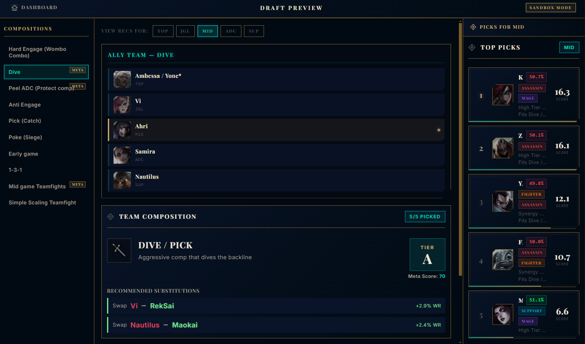
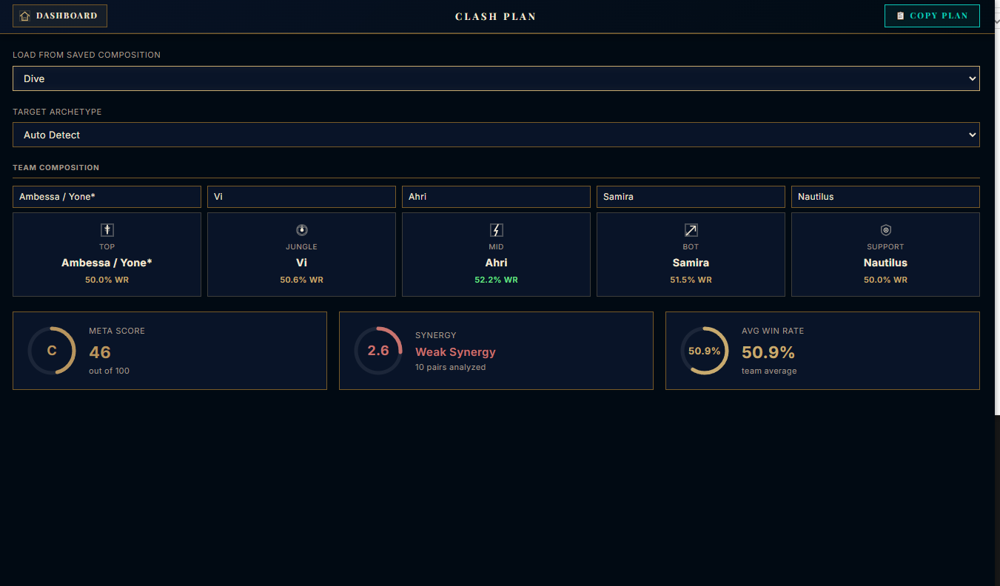
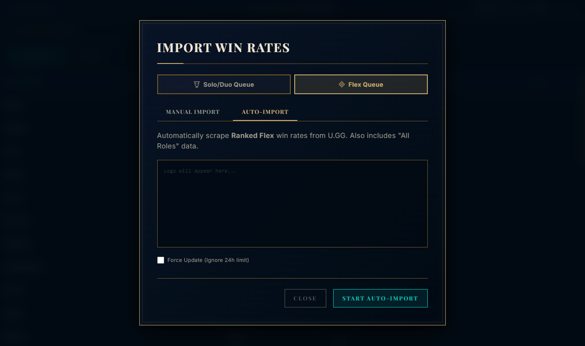

# League Composer

Recomendador de Draft en tiempo real para League of Legends — una aplicacion de escritorio que se conecta al Cliente de League y ofrece recomendaciones inteligentes de campeones durante la Seleccion de Campeones.

## Capturas de Pantalla

### Draft Preview — Simulador Sandbox
Simula drafts contra composiciones guardadas, visualiza recomendaciones por rol y analiza arquetipos con sustituciones sugeridas.



### Clash Plan — Planificacion de Torneo
Carga composiciones guardadas, asigna campeones por rol y evalua el Meta Score, sinergia y win rate promedio del equipo.



### Importador de Win Rates — Scraping de U.GG
Importa automaticamente estadisticas de win rate desde U.GG para Solo/Duo y Flex Queue.



## Funcionalidades

- **Recomendaciones en Vivo** — Se conecta al Cliente de League via LCU API y puntua campeones en tiempo real basandose en counters, sinergias, win rates y encaje de composicion
- **Analisis de Composicion** — Detecta arquetipos (Hard Engage, Dive, Poke, Splitpush, etc.) y califica las fortalezas y debilidades del equipo
- **Mapa de Calor de Sinergias** — Matriz visual que muestra la efectividad de emparejamientos entre campeones
- **Explorador de Win Rates** — Navega y filtra estadisticas de campeones por rol, tipo de cola y tier
- **Importacion desde U.GG** — Scraping automatizado de win rates, pick rates y ban rates para Solo Queue y Flex
- **Team Builder** — Planifica composiciones personalizadas con analisis en vivo
- **Gestor de Roster** — Configura nombres de jugadores, roles y pools de campeones favoritos
- **Planificador de Clash** — Herramientas de planificacion de draft especificas para torneos
- **Sandbox de Draft** — Simula drafts contra composiciones guardadas para probar recomendaciones

## Stack Tecnologico

| Capa | Tecnologia |
|------|------------|
| Frontend | React 19, Tailwind CSS 4 |
| Escritorio | Electron 34 |
| Build | Vite 6, Electron Builder |
| Datos | Axios, Puppeteer, WebSocket (ws) |

## Requisitos Previos

- [Node.js](https://nodejs.org/) (v18 o superior recomendado)
- Cliente de League of Legends instalado (para las funciones de draft en vivo)

## Inicio Rapido

```bash
# Clonar el repositorio
git clone https://github.com/kothaz00n/league-composer.git
cd league-composer

# Instalar dependencias
npm install

# Iniciar en modo desarrollo
npm run dev
```

La app se lanza con hot-reload de Vite en `localhost:5173` y abre una ventana de Electron automaticamente.

## Scripts Disponibles

| Comando | Descripcion |
|---------|-------------|
| `npm run dev` | Inicia Vite + Electron concurrentemente (desarrollo) |
| `npm run vite:dev` | Inicia solo el servidor de desarrollo de Vite |
| `npm run electron:dev` | Inicia solo Electron |
| `npm run build` | Build de produccion (bundle de Vite + instalador NSIS) |

## Como Funciona

1. **Conexion** — La app lee el lockfile del Cliente de League para obtener credenciales de autenticacion, luego se conecta via HTTPS y WebSocket
2. **Deteccion** — Cuando comienza la Seleccion de Campeones, la app recibe eventos en tiempo real de picks, bans y asignaciones de rol
3. **Puntuacion** — El motor de recomendaciones evalua cada campeon disponible usando:
   - Rendimiento de counter matchup vs picks enemigos
   - Bonus de sinergia con picks aliados
   - Win rate actual del meta
   - Encaje de arquetipo para la composicion del equipo
   - Filtrado por rol y pool de campeones
4. **Visualizacion** — Las recomendaciones rankeadas se muestran junto con un analisis de composicion en vivo

## Estructura del Proyecto

```
src/
├── main/              # Proceso principal de Electron
│   ├── main.js        # Ciclo de vida de la app, handlers IPC, gestion de ventanas
│   ├── preload.js     # Puente seguro renderer <-> main
│   ├── lcu/           # Integracion con League Client (REST + WebSocket)
│   └── scrapers/      # Scraper de datos de U.GG
├── renderer/          # Frontend React
│   ├── App.jsx        # Componente raiz y enrutamiento de vistas
│   └── components/    # Componentes UI (Dashboard, DraftBoard, etc.)
├── engine/            # Algoritmo de recomendacion y calculos de sinergia
├── data/              # Datos de campeones, win rates, counters, composiciones
└── common/            # Constantes compartidas (canales IPC)
```

## Fuentes de Datos

- **[Data Dragon](https://developer.riotgames.com/docs/lol#data-dragon)** — Metadata de campeones (nombres, roles, tags)
- **[U.GG](https://u.gg/)** — Win rates, pick rates, ban rates, tier lists
- **Archivos JSON locales** — Base de datos de counters/sinergias, composiciones guardadas, configuracion de roster

## Build de Produccion

```bash
npm run build
```

El output se genera en `dist_electron/` como un instalador NSIS para Windows.

## Licencia

ISC
